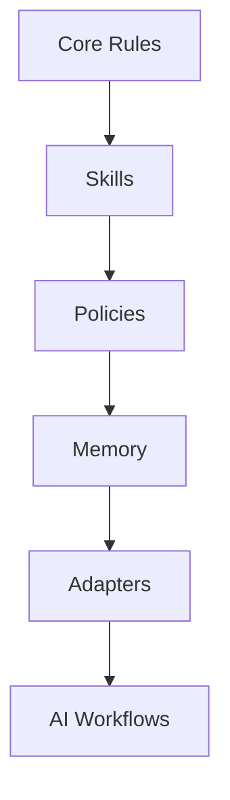

# ai-coding-rules

## Project Overview

`ai-coding-rules` is a lightweight governance framework for AI-assisted software
engineering.

It provides portable `AGENTS.md` standards, safety rules, workflow patterns,
memory templates, policy examples, and tool adapters for coding agents. The
repository is intentionally small: use the README for orientation and the
[GitHub Wiki](https://github.com/serviceontheweb/ai-coding-rules/wiki) for
technical reference material.

## Why AI Engineering Governance Matters

AI coding agents work best when repositories define clear operating boundaries.
Governance files help teams keep agent work scoped, reviewable, validated, and
safe across tools.

This project focuses on:

- coding agent safety;
- context discipline;
- workflow discipline;
- agent memory systems;
- portable AI engineering workflows;
- tool-neutral AI development governance.

## Core Concepts



The core rule set defines baseline behavior. Extensions add focused workflows,
machine-readable policy examples, project memory, and tool-specific integration
notes.

## Repository Architecture

```text
ai-coding-rules/
  core/       Shared operating contract
  skills/     Modular task workflows
  policies/   Machine-readable policy examples
  memory/     Lessons and decision templates
  adapters/   Tool-specific integration notes
  templates/  Starter files for project types
  docs/       Source documentation
  wiki/       GitHub Wiki source pages
```

## Quick Start

Copy the baseline contract into a project:

```bash
cp core/AGENTS.md /path/to/project/AGENTS.md
cp memory/lessons-template.md /path/to/project/LESSONS.md
cp templates/CHANGELOG-template.md /path/to/project/CHANGELOG.md
```

Then add only verified project facts: stack, commands, validation expectations,
local constraints, and approval requirements.

Recommended next reading:

- [Wiki Home](https://github.com/serviceontheweb/ai-coding-rules/wiki)
- [Architecture Overview](https://github.com/serviceontheweb/ai-coding-rules/wiki/Architecture-Overview)
- [AGENTS.md Standards](https://github.com/serviceontheweb/ai-coding-rules/wiki/AGENTS.md-Standards)
- [Safety Rules](https://github.com/serviceontheweb/ai-coding-rules/wiki/Safety-Rules)

## Supported Tools

- [Codex](adapters/codex/)
- [Claude Code](adapters/claude-code/)
- [Cursor](adapters/cursor/)
- [GitHub Copilot](adapters/copilot/)
- [Aider](adapters/aider/)

Compatibility pointers for older adapter paths remain in `adapters/`.

## Governance Components

- `core/AGENTS.md` defines the portable operating contract.
- `core/SAFETY.md` defines approval gates and protected data handling.
- `core/CONTEXT.md` defines bounded inspection patterns.
- `core/MEMORY.md` defines lessons, changelog, and decision record usage.
- `core/WORKFLOWS.md` defines common agent session patterns.
- `skills/` contains lightweight workflow modules.

## Policy System

The `policies/` directory contains generic YAML examples for future validation
and automation:

- `policies/approval-gates.yaml`
- `policies/safety-policy.yaml`
- `policies/deployment-policy.yaml`

See the
[Policy System wiki page](https://github.com/serviceontheweb/ai-coding-rules/wiki/Policy-System)
for the policy model.

## Memory System

The `memory/` directory provides templates for durable project knowledge:

- `memory/lessons-template.md`
- `memory/architecture-decisions-template.md`
- `memory/anti-patterns-template.md`

See
[Memory Systems](https://github.com/serviceontheweb/ai-coding-rules/wiki/Memory-Systems)
for usage guidance.

## Wiki & Documentation Links

- [GitHub Wiki](https://github.com/serviceontheweb/ai-coding-rules/wiki)
- [Core Concepts](https://github.com/serviceontheweb/ai-coding-rules/wiki/Core-Concepts)
- [Workflow Patterns](https://github.com/serviceontheweb/ai-coding-rules/wiki/Workflow-Patterns)
- [Skill Design Standards](https://github.com/serviceontheweb/ai-coding-rules/wiki/Skill-Design-Standards)
- [Tool Adapters](https://github.com/serviceontheweb/ai-coding-rules/wiki/Tool-Adapters)
- [Releases](https://github.com/serviceontheweb/ai-coding-rules/releases)

## Contribution Guidelines

Keep contributions public-safe, generic, concise, and tool-neutral.

- Put shared rules in `core/`.
- Put workflow behavior in `skills/`.
- Put machine-readable examples in `policies/`.
- Put tool-specific setup in `adapters/`.
- Put detailed technical reference content in `wiki/`.
- Avoid private organization details, credentials, and proprietary workflows.

See the
[Contribution Guide](https://github.com/serviceontheweb/ai-coding-rules/wiki/Contribution-Guide)
for documentation standards.

## License

MIT. Use, fork, adapt, and share.
