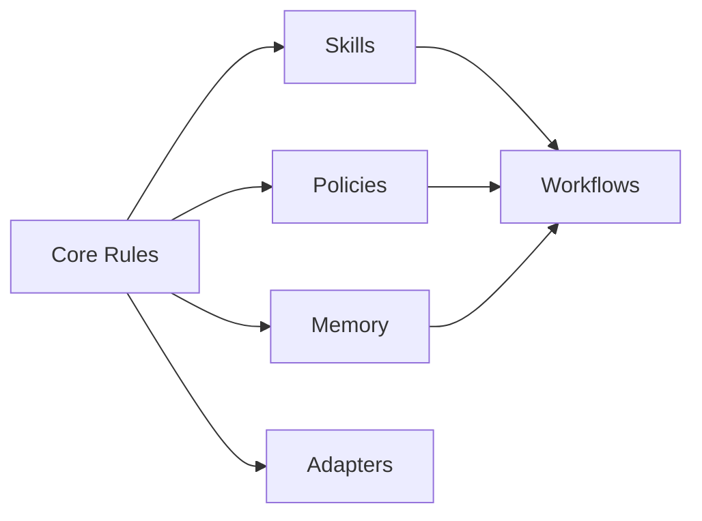

# Architecture Overview

The repository uses a Core + Extensions architecture.

## Repository Model

```text
core/       Shared rules
skills/     Workflow modules
policies/   YAML policy examples
memory/     Durable knowledge templates
adapters/   Tool integration notes
templates/  Project starter files
docs/       Documentation source
wiki/       Technical knowledge base
```

## Design Intent

- Keep the operating contract small.
- Move technical reference material into the wiki.
- Keep extensions modular and optional.
- Avoid duplicating the same rules across files.
- Keep all examples generic and public-safe.

## Dependency Direction



## Related Pages

- [Core Concepts](Core-Concepts)
- [Policy System](Policy-System)
- [Skill Design Standards](Skill-Design-Standards)
