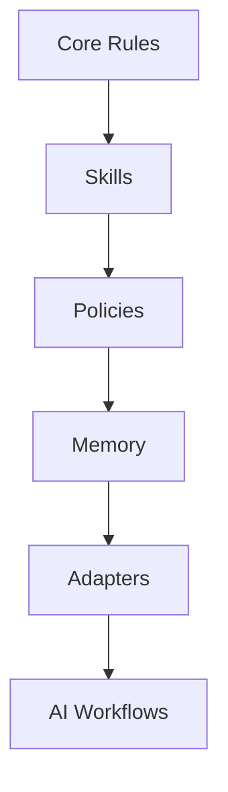

# ai-coding-rules Wiki

`ai-coding-rules` is a lightweight governance framework for AI-assisted software
engineering.

The wiki is the technical reference for AI coding governance, AGENTS.md
standards, coding agent safety, operational AI systems, workflow discipline,
agent memory systems, policies, skills, and tool adapters.

[Back to repository](https://github.com/serviceontheweb/ai-coding-rules)

## Architecture

## Getting Started Path

1. Read [Core Concepts](Core-Concepts).
2. Review [Architecture Overview](Architecture-Overview).
3. Apply [AGENTS.md Standards](AGENTS.md-Standards).
4. Add [Safety Rules](Safety-Rules).
5. Choose relevant [Tool Adapters](Tool-Adapters).
6. Add [Memory Systems](Memory-Systems) when durable lessons are useful.

## Navigation

### Foundations

- [Architecture Overview](Architecture-Overview)
- [Core Concepts](Core-Concepts)
- [AGENTS.md Standards](AGENTS.md-Standards)
- [Safety Rules](Safety-Rules)
- [Context Discipline](Context-Discipline)

### Operating Model

- [Memory Systems](Memory-Systems)
- [Workflow Patterns](Workflow-Patterns)
- [Policy System](Policy-System)
- [Skill Design Standards](Skill-Design-Standards)

### Tooling

- [Tool Adapters](Tool-Adapters)
- [Codex Integration](Codex-Integration)
- [Claude Code Integration](Claude-Code-Integration)
- [Cursor Integration](Cursor-Integration)

### Project

- [Contribution Guide](Contribution-Guide)
- [Roadmap](Roadmap)
- [FAQ](FAQ)

## Quick Links

- [README](https://github.com/serviceontheweb/ai-coding-rules#readme)
- [Releases](https://github.com/serviceontheweb/ai-coding-rules/releases)
- [Core files](https://github.com/serviceontheweb/ai-coding-rules/tree/main/core)
- [Skills](https://github.com/serviceontheweb/ai-coding-rules/tree/main/skills)
- [Policies](https://github.com/serviceontheweb/ai-coding-rules/tree/main/policies)
- [Adapters](https://github.com/serviceontheweb/ai-coding-rules/tree/main/adapters)

## Recommended Reading Order

- New users: Core Concepts, Quick Start in README, AGENTS.md Standards.
- Maintainers: Architecture Overview, Policy System, Skill Design Standards.
- Tool users: Tool Adapters, then the integration page for the chosen tool.
